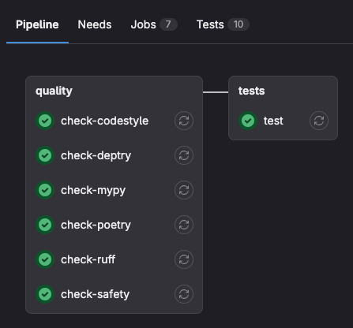
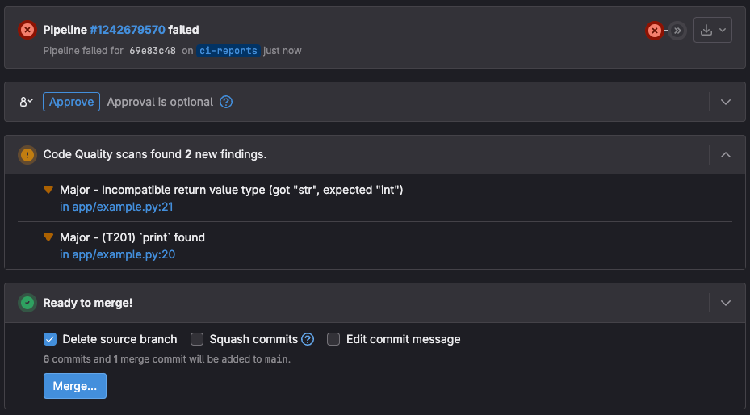
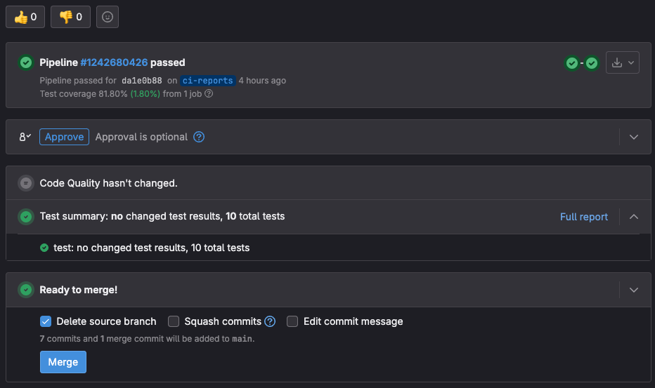

## Gitlab CI

### Pipelines

Gitlab CI contains of two stages: 
- **quality**. On this stage gitlab runner checks that all linters pass without errors.
- **tests**. On this stage gitlab runner test the application with `pytest`.

### Code quality
Reports from `ruff` and `mypy` are also displayed in "Code quality" section.
If linters find any errors, they will be showed there.

### Tests
Test report is also available in a merge request. You can click on "Full reports" to 
see the result of each individual test.

